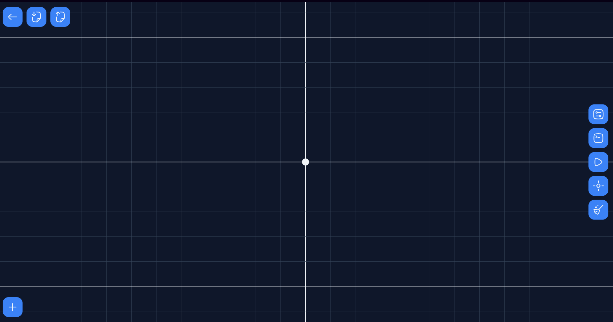
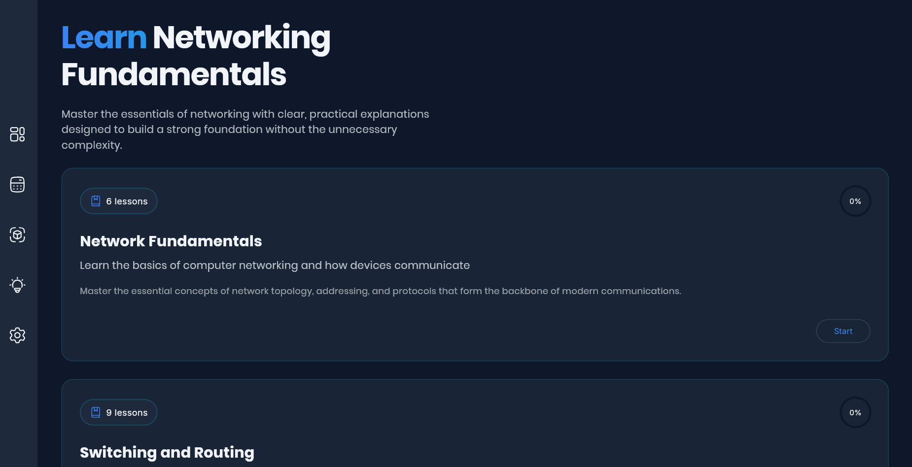
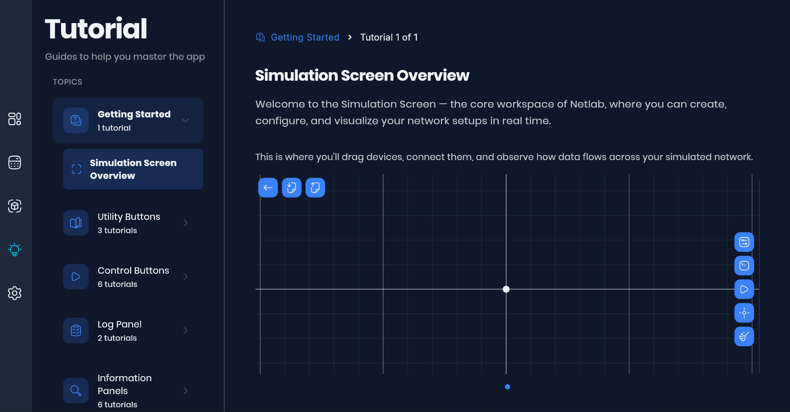
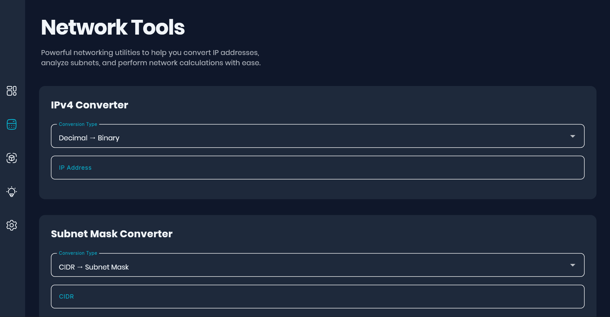

<h1 align="center">NetLab</h1>

  

**Interactive Network Learning & Simulation Platform**

Learn networking by doing—design networks, run simulations, and master networking fundamentals.

### Technologies Used

  
  
  
  
  

  <em>Built with Dart & Flutter • Cloud-synced with Firebase • Cross-platform: Android, iOS, Web, Desktop</em>

[Getting Started](#quick-start) • [Features](#features) • [Simulator](#network-simulator) • [Curriculum](#learning-curriculum)

---

NetLab is an interactive educational application designed to teach computer networking fundamentals through a combination of structured learning materials, hands-on network simulation, and practical networking tools. Whether you're a student, aspiring network administrator, or IT professional, NetLab provides an immersive environment to understand how networks operate in practice.

## Quick Start

**Explore three ways to learn:**

1. **🎮 Network Simulator** - Design and simulate real-world network topologies. Create devices, define connections, and observe ARP and packet routing in real-time.
2. **📚 Study Materials** - Work through 5 chapters of structured networking content with interactive quizzes and detailed explanations.
3. **🛠️ Utility Tools** - Use quick-reference calculators for IP addresses, subnet masks, and network analysis.

## Table of Contents

- [Features](#features)
- [Network Simulator](#network-simulator)
- [Learning Curriculum](#learning-curriculum)
- [Tutorials & Tools](#tutorials--tools)

## Features

- 🎮 **Network Simulator** - Design and simulate real network topologies with visual packet routing and ARP protocol
- 📚 **5-Chapter Curriculum** - Fundamentals, switching, routing, and advanced networking concepts
- 🎓 **Interactive Tutorials** - Step-by-step guidance for every feature
- 🛠️ **Network Tools** - IP converter, subnet calculator, and network analyzer
- 📊 **Progress Tracking** - Track lessons, quizzes, and learning analytics
- 🌙 **Customization** - Light/dark themes and adjustable fonts
- 📱 **Cross-Platform** - iOS, Android, Windows, macOS, and web
- 🔒 **Offline-First** - Access content offline with cloud sync

---

## Network Simulator

  

The core of NetLab—build networks and watch them work in real-time.

**Key Features:**
- Create and configure network devices (routers, switches, hosts, access points, wireless devices)
- Draw connections between devices
- Run simulations with ARP protocol and packet routing
- Watch real-time event logs and packet movement
- Save and load your network projects
- Explore networking concepts through hands-on practice

**Learn:** How devices communicate.

---

## Learning Curriculum

  

Master networking fundamentals through a structured, progressive 5-chapter course:

| Chapter | Title | Topics |
|---------|-------|--------|
| **1** | Network Fundamentals | Hosts, Internet, Networks, IP Addressing, OSI Model |
| **2** | Switching & Routing | MAC Addresses, Switch Operations, Routing Tables, Static/Dynamic Routing |
| **3** | Network Devices | Switches, Routers, Hosts, Access Points, Wireless Devices |
| **4** | Host-to-Host Communication | ARP Protocol, Data Transmission, Network Efficiency |
| **5** | Subnetting | CIDR Notation, Subnet Masks, Network Attributes, Practice Exercises |

Each chapter includes lessons, quizzes with explanations, and chapter assessments.

---

## Tutorials & Tools

  

**Interactive Tutorials** - In-app guided walkthroughs for the simulator.

**Network Tools:**

  

- IP Converter - Convert between formats
- Subnet Calculator - CIDR and subnet calculations
- Network Analyzer - Analyze IPv4 subnets

---

## Get Started

1. **Open the Simulator** - Start on the home screen and design your first network
2. **Follow Tutorials** - Learn features step-by-step with visual guidance
3. **Study Lessons** - Go to the dashboard and work through Chapter 1
4. **Practice Tools** - Use calculators while building your networks
5. **Track Progress** - Check your advancement in dashboard

---

## Call to Action

Ready to master networking? **Download NetLab and start building networks today!**

⭐ Star this project if you find it helpful
📧 Have feedback? Report issues or suggest features
🤝 Want to contribute? Check out our contribution guidelines

<!-- Notes: 
    Add useful information here that you think that will help us.

Useful commands:
    flutter upgrade - upgrade your sdk first
    flutter pub upgrade - upgrade you dependecies

    flutter analyze - analyze the code but I think you can see it in problem tab beside the terminal.
    dart fix --apply - will fix the problem in your flutter analyze if it can auto fix it.

    dart format . - format you code in dart way xd.
    dart run custom_lint - check your riverpod code xd

    flutter test - run all test in ~/test folder.
    flutter test test/sample_test.dart  - run a specific test.

Useful website to look for: 
    https://dart.dev  - if you want to learn more about the language.
    https://api.dart.dev - docs for api in dart language.

    https://docs.flutter.dev - if you want to learn more about the Framework.
    https://api.flutter.dev - docs for api in flutter framework.

    https://pub.dev  - for package/plugins.

    https://dartpad.dev - playground for dart and flutter codes.
    https://zapp.run - whole editor for flutter lol

Excalidraw Notes: 
    Luto ni allan
        https://excalidraw.com/#json=gv6gncOqVMgkt6lthZ3F5,i8dpEYkjw-hR3CaGYLGLQQ
    Note sa Mechanics ng simulator:
        https://excalidraw.com/#json=qs16GfnYCkcK83BrMZ5q_,VxgJQlCwFXIhecGRbP1ZJA
    Color Pallete:
        https://excalidraw.com/#json=E7hUGyqdQD0eGazwsx5hD,FmNb_mWiDESaI4Mr7lqlrg
    Final UI:
        https://excalidraw.com/#json=dpUP5eWpvFd2yntS7vOaB,75qYBIyHknsrnnTs0bWWYg

WorkFlow and shit for our productivity and collaboration :
    Forked our repo first then bala kana kung ano gawin mo don sa repo mo tas pag uupload nyo na yung changes sa
    main repo "git pull --rebase" nyo muna yung branch sa forked repo tas saka nyo push sa main repo, linear lang dapat
    ang mangyayari sa git history natin.

    ps. you can use "git commit --amend --no-edit" kung may hahabol kang changes sa commit mo it's useful command search about it.

    sa commit message naman ket ganto nalang: "Type: Purpose" for example "chore: update dependecies" 
    
    Type:       Purpose:
    feat        Intorduce a new feature
    fix         Fixes bug
    docs        Changes to documentation only
    style       Code style changes (formatting, missing semicolons, etc.)-no logic
    refactor    Code changes that neither fix a bug nor add a feature
    test        Adding or updating test
    chore       Routing tasks like build scripts, configs, or dependecy update
    build       Changes that affect the build system or external dependencies
    ci          Changes to CI/CD configuration files and scripts
    perf        Code changes that improve perfomance
    revert      Reverts a previous commit

    (10 mins) How to Write a Git Commit Message: Conventions & Best Practices
        https://youtu.be/9ilpKtF0KGQ?si=vTaau_o7iFp0adJJ

    (4 mins) Never use git pull
        https://youtu.be/xN1-2p06Urc?si=oueXWIJJUvqUPpAu

Youtube Videos you might find helpful (don't get stuck on tutorial hell, watch it 2x speed lol):

    -Networking Related : 
        (Playlist) Networking Fundamentals
            https://youtube.com/playlist?list=PLIFyRwBY_4bRLmKfP1KnZA6rZbRHtxmXi&si=gv2XohVBLuKKMqDu
        (Playlist) FREE CCNA 200-301
            https://youtube.com/playlist?list=PLIhvC56v63IJVXv0GJcl9vO5Z6znCVb1P&si=c-HX-P8Z38oTdy1S
        Internet - CS50's Understanding Technology 2017
            https://youtu.be/n_KghQP86Sw?si=bz4wlDxuIOZreL98

    -Flutterr/Dart Related: 
        (2 hrs) The Complete Dart & Flutter Developer Course | Full Tutorial For Beginners to Advanced
            https://youtu.be/CzRQ9mnmh44?si=zeivDb8VSpsvVCaw 
        (3 mins) Dart in 100 Seconds
            https://youtu.be/NrO0CJCbYLA?si=bCf1B97eqQ3SnHEr
        (3 mins) Flutter in 100 seconds
            https://youtu.be/lHhRhPV--G0?si=AzYXV_aBKkoVo5lp
        (12 mins) Flutter Basic Training - 12 Minute Bootcamp
            https://youtu.be/lHhRhPV--G0?si=gCGW9GPHqfe-stRE
        (9 mins) Top 12 Flutter Tips & Tricks
            https://youtu.be/FdgDgcrDeNI?si=7NRUG4cKX3NOkO03
        (14 mins) Flutter State Management - The Grand Tour
            https://youtu.be/3tm-R7ymwhc?si=Y46jTCMXo41arTg8
        (9 mins) uild 5 Apps in 5 Minutes with Flutter… But should you?
            https://youtu.be/7JdcGBSWo50?si=rtJFuJbTW7e6F-V-
        (4 mins) Clean Architecture in Flutter - All You Need to Know!
            https://youtu.be/zon3WgmcqQw?si=zlL1Ma6bpNriKWDv

        - Riverpod
        (8 mins) Flutter Riverpod EASY Tutorial
            https://youtu.be/7Cp1GlmHTGE?si=Abybk7wVpC91aId5
        (2 hrs) Flutter Riverpod 2 Tutorial for Beginners | Riverpod Generator
            https://youtu.be/pwflXIA-6YQ?si=rEj3zaeeriHyO6cm

        - Unit/Integration Testing 
        (Playlist) Flutter Testing Tutorial For Beginners
            https://youtube.com/playlist?list=PLlzmAWV2yTgAW2rVT0sqRmtBXc-pmBnJG&si=2OrG1U4IkfOHSkRk

Current version:
    dart = Dart SDK version: 3.11.0
    flutter = Flutter 3.41.2

    Android: 
        compileSdk = 36
        buildToolsVersion = "36.0.0"
        ndkVersion = "29.0.13599879"
        cmake = "4.0.3"
        java = 17

-->